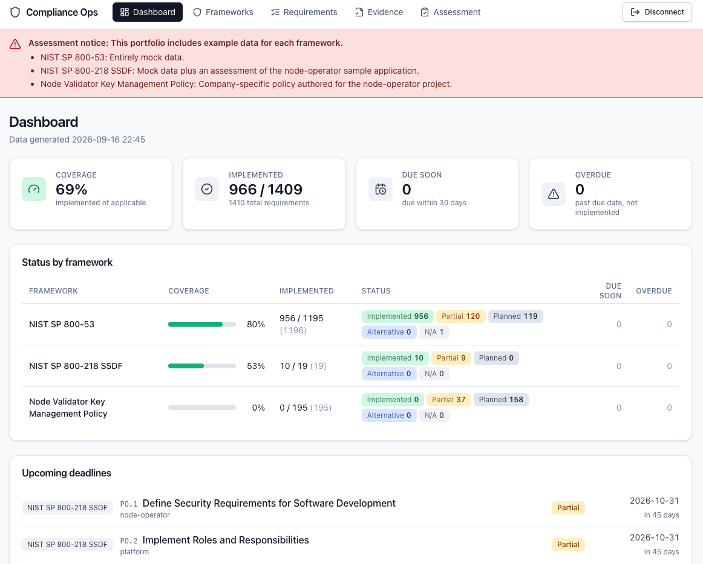

# Compliance Ops

[](https://github.com/s1ns3nz0/compliance-ops/actions/workflows/ci.yml)


[](LICENSE)

Compliance Ops turns OSCAL catalogs and profiles into a working compliance
program. Teams track controls, evidence, assessments, coverage, and deadlines
in one web application.



## Features

- Import OSCAL catalogs and profiles from configured sources or JSON files.
- Track implementation status, owner, due date, application scope, and a
  Markdown description for each control statement.
- Add requirement notes and manual status overrides.
- Reuse application scopes across control statements.
- Browse assessment plans, assessment results, and POA&Ms.
- Map assessment items to requirements without changing implementation status.
- Attach link or file evidence to requirements.
- Filter requirements by framework, status, text, or application scope.
- Review coverage, status totals, overdue work, and upcoming deadlines.
- View an append-only audit history for tracking and evidence changes.

## Demo data

The included portfolio uses example data:

- NIST SP 800-53: Entirely mock data.
- NIST SP 800-218 SSDF: Mock data plus an assessment of the node-operator sample application.
- Node Validator Key Management Policy: Company-specific policy authored for the node-operator project.

## Run locally

Copy the environment template and replace every placeholder. The database
password is interpolated into `DATABASE_URL`, so use only URL-safe unreserved
characters: letters, digits, `-`, `.`, `_`, or `~`.

```sh
cp .env.example .env
```

Create `.env.tokens` as a raw JSON object with your own random bearer token:

```json
{"operator-label":"replace-with-your-random-token"}
```

```sh
chmod 600 .env.tokens
docker compose up -d --build
```

Open [http://localhost:3000](http://localhost:3000). Compose binds every host
port to `127.0.0.1`; optional port overrides are documented in `.env.example`.

## MCP

Separate MCP servers provide authenticated application access and read-only
NIST catalog access. See [mcp/README.md](mcp/README.md).

## Docs

- [OpenAPI contract](openapi.yaml)
- [Web UI](web/README.md)
- [Kubernetes deployment](deploy/kubernetes/README.md)
